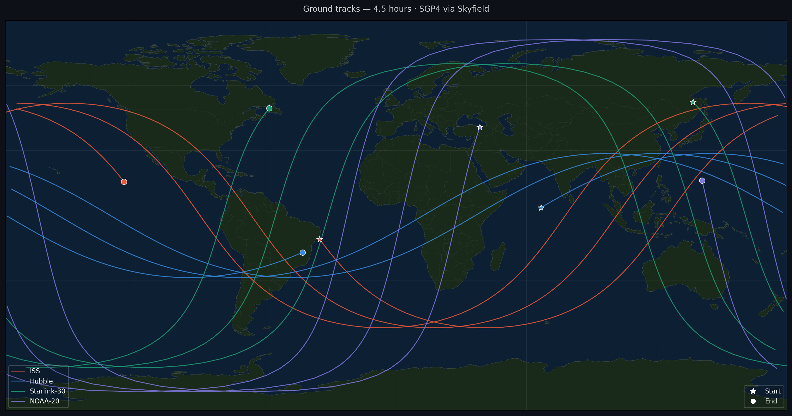

# Orbit Propagator

Satellite orbit propagation from live TLE data, with a custom RK4 integrator built from the equations of motion.



## What it does

Fetches real orbital elements (OMM format) from CelesTrak for four satellites — ISS, Hubble, Starlink-30, and NOAA-20 — and propagates their trajectories using two approaches:

**SGP4** via `python-sgp4`. The standard analytical propagator used operationally for all publicly tracked objects. `Satrec.sgp4()` outputs positions in TEME (True Equator Mean Equinox), the native frame of the SGP4 model.

**Custom RK4 integrator** built from the equations of motion, with three pluggable force models:
- Two-body Keplerian (point-mass gravity only)
- J2 perturbation (Earth's equatorial bulge)
- J2 + exponential atmospheric drag (piecewise layer table from Vallado & McClain, calibrated against CIRA-72)

**Coordinate conversion** — converting TEME to geographic coordinates requires more than a GMST rotation. TEME differs from standard inertial frames (GCRS, J2000) by precession and nutation corrections. This is handled via Skyfield, which applies the full IAU transformation chain: TEME → GCRS → ITRF → lat/lon.

## Results

Ground tracks for 4 satellites over 4.5 hours, rendered on a Natural Earth background with cartopy.

ISS altitude oscillation over 24 hours — the orbit varies between ~425 and ~429 km per revolution, reflecting the small eccentricity (~0.0002) of the ISS orbit.

The RK4 propagator hierarchy (Keplerian → J2 → J2+drag) is implemented and available in `src/propagator.py`. A meaningful quantitative comparison against SGP4 requires working in osculating orbital elements rather than Cartesian position — positional error in ECI conflates model accuracy with orbital phase difference. This is left for a follow-up project.

## Notes on the drag model

The exponential atmosphere uses a piecewise layer table from Vallado & McClain / CIRA-72. This is a static mean model — real atmospheric density at LEO altitudes varies significantly with solar activity and geomagnetic conditions. The model gives order-of-magnitude drag estimates, not precision propagation.

`CD = 2.2` and `A/m = 0.01 m²/kg` are representative values for a 3U CubeSat in free molecular flow and would need to be adjusted for a specific spacecraft.

## Run
```bash
git clone https://github.com/julietaamendola/orbit-propagator.git
cd orbit-propagator/p1-orbit-propagator
python3 -m venv venv
source venv/bin/activate
pip install -r requirements.txt
python3 main.py
```

On first run, TLE data is fetched from CelesTrak and cached in `data/`. Subsequent runs use the cache.

## Structure
```
p1-orbit-propagator/
├── main.py
├── src/
│   ├── tle_fetcher.py    — CelesTrak API client with local cache
│   ├── propagator.py     — SGP4 wrapper + RK4 integrator (Keplerian, J2, J2+drag)
│   └── visualizer.py     — ground tracks + altitude plot + propagator comparison
└── requirements.txt
```

## References

- Vallado, D.A. *Fundamentals of Astrodynamics and Applications*, 4th ed. Microcosm Press, 2013.
- Kelso, T.S. CelesTrak GP data formats. https://celestrak.org/NORAD/documentation/gp-data-formats.php
- Rhodes, B. Skyfield documentation. https://rhodesmill.org/skyfield/
